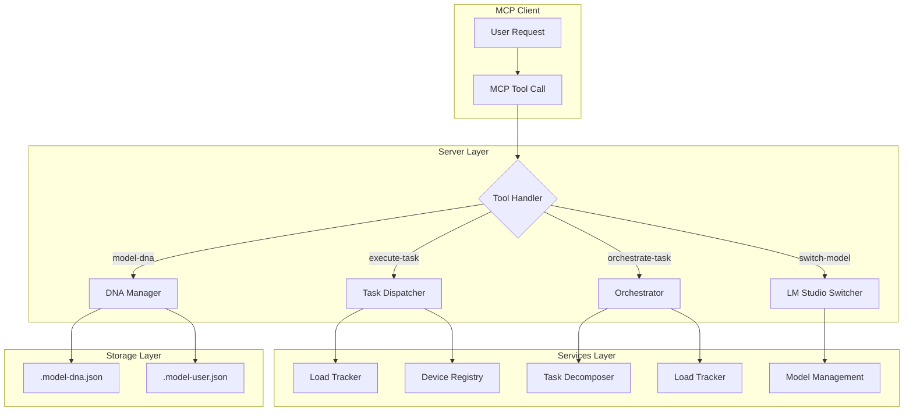

# MCP Local Helper

## Overview

MCP Local Helper is a sophisticated intelligent model management system that provides automatic model selection, intelligent task routing, and multi-device orchestration for LM Studio through the Model Context Protocol (MCP). The system uses a DNA-based configuration architecture to track model effectiveness across different task types, enabling continuous optimization of model assignments based on actual performance data.

### Core Capabilities

1. **Intelligent Model Selection** - Automatically selects optimal models based on historical performance ratings and capability matching
2. **Task Decomposition & Parallel Execution** - Breaks complex tasks into parallelizable subtasks using DAG-based scheduling
3. **Multi-Device Orchestration (LM Link)** - Distributed execution across multiple devices connected via Tailscale mesh VPN
4. **Load-Aware Dispatching** - Routes tasks to least-loaded devices with appropriate hardware tiers
5. **Model Load Management** - Enforces per-device model limits (default: 1) to optimize memory usage
6. **Automatic Evolution** - Continuously improves configuration based on usage patterns and effectiveness ratings

### SWARM Research Orchestrator (New in v3)

**Overview:**
The SWARM Research Orchestrator enables distributed research across multiple lightweight models (5.6GB like qwen3.5-9b) on devices connected via LM Link/Tailscale. It automatically decomposes complex research queries into parallel subtasks, executes them across available lightweight models on multiple devices, and aggregates results into a compacted ~2048 token final response.

**Key Features:**
- **Parallel Research Execution**: Distributes research subtasks to multiple lightweight models across networked devices
- **Task Decomposition**: Automatically breaks complex queries into focused subtasks
- **Result Compaction**: Aggregates and compacts results for efficient responses
- **Guardrails System**: Enforces memory limits (min 8GB free) and concurrent model limits per device
- **Lightweight Model Support**: Designed for models under ~10GB that can run on distributed devices

**Configuration:**

DNA Configuration:
```json
{
  "orchestratorConfig": {
    "swarm": {
      "enabled": true,
      "maxLightweightModelsPerDevice": 2,
      "subtaskMaxTokens": 4000,
      "finalAggregationMaxTokens": 8000,
      "minMemoryGB": 8
    },
    "lightweightModelIds": [
      "qwen3.5-9b-omnicoder-claude-polaris-text-dwq4-mlx",
      "meta-llama-3.2-9b-instruct"
    ]
  }
}
```

**Hardware Recommendations:**
- < 16GB RAM: Max **2 concurrent lightweight models** per device
- 16-31GB RAM: Max **4 concurrent lightweight models** per device  
- 32GB+ RAM: Max **8 concurrent lightweight models** per device

---

### Model Load Management (New in v2)

**Overview:**
MCP Local Helper now includes fine-grained model load control to optimize memory usage on resource-constrained systems. By default, only **1 model per device** can be loaded at a time.

**Key Features:**
- **Conservative Default**: 1 model per device (prevents memory exhaustion)
- **Hardware Detection**: Automatically detects RAM/CPU for recommendations
- **Tunable**: Override via DNA configuration or environment variables
- **Auto-Eviction**: When limit reached, oldest model is automatically unloaded

**Configuration Options:**

| Method | Example |
|--------|---------|
| DNA Config | `"maxModelsPerDevice": {"*": 3}` |
| Per Device | `"device-local": 2` |
| Environment | `MAX_MODELS_PER_DEVICE=3` |

**Hardware Recommendations** (when not explicitly configured):
- < 8GB RAM: **1 model** (conservative)
- 8-15GB RAM: **1 model** (default for safety)
- 16-31GB RAM: **2 models** (recommended)
- 32GB+ RAM: **4 models** (high-end)

**How It Works:**
1. Check DNA's `orchestratorConfig.maxModelsPerDevice` configuration
2. Fall back to hardware-based detection via `getMaxModelsPerDevice()`
3. Unload oldest model (FIFO) when limit is exceeded
4. Per-device limits allow heterogeneous multi-machine setups

**DNA Schema:**
```json
{
  "orchestratorConfig": {
    "maxModelsPerDevice": {
      "*": 3,
      "device-local": 2,
      "device-12345678": 4
    }
  }
}
```

### Architecture Phases

| Phase | Status | Description |
|-------|--------|-------------|
| Phase 1 | ✅ Complete | Core DNA System - Configuration management, max models per device limits, hardware detection |
| Phase 2 | ✅ Complete | Model Switching Service - LM Studio integration for model lifecycle management |
| Phase 3 | ✅ Complete | Task Dispatcher - Intelligent task classification and routing with fallback mechanisms |
| Phase 4 | ✅ Complete | Tools Implementation - MCP server exposing four core tools for client interaction |
| Phase 5 | ✅ Complete | Evolution and Auto-Optimization - Automatic configuration improvement based on usage patterns |
| Phase 6 | ✅ Complete | LM Link Multi-Device Orchestration - Parallel execution across multiple devices |
| Phase 7 | ✅ Complete | SWARM Research Orchestrator - Distributed research across lightweight models with guardrails |

---

## Prerequisites

Before installing and using MCP Local Helper, ensure the following requirements are met:

1. **Node.js version 18.0.0 or higher** installed on your system
   - Required for modern JavaScript features (ES modules, async/await, etc.)
   - Use `node --version` to verify your installation

2. **LM Studio installed and running locally**
   - Download from [lmstudio.ai](https://lmstudio.ai)
   - At least one model must be downloaded and available
   - The API server should be accessible at `http://localhost:1234`

3. **MCP-compatible client** (such as an AI assistant that supports Model Context Protocol)
   - Claude Desktop, Zed Editor, or custom MCP clients

4. **Package manager**
   - npm (bundled with Node.js) or yarn for dependency installation

### Optional: LM Link Setup (Multi-Device)

For multi-device orchestration via LM Link:
1. Install LM Studio on additional devices
2. Connect all devices to the same Tailscale network
3. Enable "Serve on Local Network" in each device's LM Studio settings
4. Load models on any device - they become accessible from localhost:1234

---

## Installation

### Step 1: Clone the Repository

```bash
git clone https://github.com/mperdum/leanzero-mcp-local-helper.git
cd mcp-local-helper
```

### Step 2: Install Dependencies

```bash
npm install
```

This installs:
- `@modelcontextprotocol/sdk` - MCP protocol implementation
- `zod` - Schema validation for type-safe configuration
- Dev dependencies for testing (`node:test`, assertions)

### Step 3: Verify Installation

```bash
npm test
```

Expected output:
```
ℹ tests 332
ℹ suites 121
ℹ pass 332
ℹ fail 0
```

All 332 tests should pass. If any fail, review the error messages and verify your environment.

---

## Architecture Overview

### System Flow



### Core Components

#### 1. Model DNA System (`src/utils/model-dna-*.js`)

The DNA system is the central configuration repository, storing all persistent state in JSON format.

**File Structure:**
```
.project-root/
├── .model-dna.json          # Primary configuration (versioned)
└── .model-user.json         # User-specific overrides
```

**DNA Schema Versioning:**
- **v1**: Initial schema with basic model definitions
- **v2**: Added taskModelMapping and usageStats
- **v3**: Enhanced with orchestratorConfig and memory storage

Automatic migrations occur when loading older DNA versions.

**Key Properties:**

```json
{
  "version": 3,
  "models": {
    "llama-3.2-3b": {
      "purpose": "conversationalist",
      "capabilities": ["general", "coding"],
      "contextLength": 8192
    }
  },
  "taskModelMapping": {
    "codeFixes": "llama-3.2-3b",
    "codeGeneration": "gpt-oss-20b",
    "research": "claude-opus"
  },
  "usageStats": {
    "modelEffectiveness": {
      "llama-3.2-3b": {
        "codeFixes": [
          {"rating": 4, "timestamp": "...", "feedback": "..."}
        ]
      }
    }
  },
  "orchestratorConfig": {
    "enabled": true,
    "maxSubtasks": 5,
    "timeoutMs": 60000
  }
}
```

#### 2. LM Studio Switcher (`src/services/lm-studio-switcher.js`)

This service provides the HTTP interface to LM Studio's v1 API.

**Key Features:**
- Automatic model loading/unloading when requested
- Parallel load management (respects hardware limits)
- Retry logic with exponential backoff
- Health check monitoring
- Caching for performance optimization

**API Methods:**

| Method | Description |
|--------|-------------|
| `checkConnection()` | Verify LM Studio is accessible |
| `getAvailableModels()` | List all models with metadata (cached 30s) |
| `getCurrentModel()` | Get currently active model instance |
| `loadModel(modelId, options)` | Load a model into memory |
| `unloadModel(instanceId)` | Unload a model from memory |
| `executeChatCompletion(...)` | Run inference with automatic loading |
| `streamChatCompletion(...)` | Streaming SSE completion |

**Hardware Detection:**
The system automatically detects:
- Total RAM (via Node.js os module or platform-specific commands)
- CPU cores count
- GPU availability (basic detection)

This information determines optimal parallel load limits.

#### 3. Task Dispatcher (`src/services/task-dispatcher.js`)

Analyzes incoming tasks and routes them to appropriate models.

**Task Classification:**
Uses pattern matching to categorize tasks:
- **codeFixes**: Tasks involving bug fixes, error resolution
- **codeGeneration**: Writing new code, functions, classes
- **codeExecution**: Running existing code, debugging
- **generalResearch**: General knowledge queries
- **visionAnalysis**: Image-based tasks (requires vision-capable model)

**Routing Algorithm:**
1. Classify task type from content analysis
2. Check DNA's `taskModelMapping` for explicit mapping
3. If no mapping exists, find highest-rated model for that task
4. Attempt execution with fallback support (up to 3 retries)

#### 4. Task Orchestrator (`src/services/orchestrator.js`)

Handles complex tasks requiring parallel execution across multiple devices.

**Task Decomposition Algorithm:**
```javascript
// Priority order for decomposition strategies:
1. Code patterns → Split into implementation + tests
2. Numbered lists → Each number becomes a subtask
3. Multiple questions → Each question extracted separately
4. "and" connector → Split by conjunctions
5. Fallback → Single synthesis task
```

**Execution Order (DAG):**
Builds dependency graph and creates parallel execution layers:
```
Task: "Write code, add tests, then deploy"
→ Layer 1: [write-code, add-tests]  // Can run in parallel
→ Layer 2: [deploy]                 // Depends on layer 1
```

**Load Balancing:**
```javascript
combinedScore = loadScore + tierBonus

// loadScore = activeRequests / concurrentLimit (0-1)
// tierBonus: ultra=-0.3, high=-0.2, medium=-0.1, low=0

// Result: Always picks least loaded device with best hardware
```

#### 5. Load Tracker (`src/services/load-tracker.js`)

Enforces concurrency limits to prevent system overload.

**Limit Configuration:**
```bash
MAX_PARALLEL_REQUESTS_GLOBAL=4        # Local device limit
DEFAULT_DEVICE_CONCURRENT_LIMIT=2     # Remote device limit
DEVICE_COOLDOWN_MS=1000               # Post-request pause
```

**State Tracking:**
- Per-device, per-model request counts
- Timestamps for request start/end
- Cooldown periods between requests
- Daily request counters

#### 6. Device Registry (`src/services/device-registry.js`)

Discovers and manages all LM Link connected devices.

**Device Discovery:**
- Reads `/api/v1/models` response from LM Studio
- Extracts `tailscale_node_id` from model metadata
- Groups models by device (Tailscale node)
- Tracks device health via periodic polling

**Hardware Profile per Device:**
```json
{
  "ramGB": 32,
  "cpuCores": 16,
  "gpuAvailable": false,
  "tier": "ultra"  // low, medium, high, ultra
}
```

#### 7. Rating Analyzer (`src/services/rating-analyzer.js`)

Calculates statistics from collected ratings.

**Metrics Computed:**
- Average rating per model/task combo
- Rating variance and standard deviation
- Low-rating rate detection (threshold configurable)
- Best/worst performing models per task type

#### 8. Evolution Engine (`src/services/evolution-engine.js`)

Generates configuration improvements based on data patterns.

**Evolution Strategies:**
1. **Model Reassignment**: Move tasks from underperforming to better models
2. **New Model Discovery**: Suggest loading better-performing unutilized models
3. **Capability Gap Filling**: Recommend models for missing capabilities

---

## Available Tools

MCP Local Helper exposes seven tools through the MCP protocol.

### switch-model Tool

Manual control over LM Studio model lifecycle operations.

**Parameters:**
```json
{
  "action": "load|unload|list|current"
}
```

**Examples:**

List all models:
```json
{"action": "list"}
```

Load a specific model:
```json
{"action": "load", "modelId": "llama-3.2-3b"}
```

Unload by instance ID:
```json
{"action": "unload", "instanceId": "inst_abc123"}
```

Get current active model:
```json
{"action": "current"}
```

---

### orchestrate-task Tool (Phase 6)

Parallel execution of complex tasks across multiple devices.

**Parameters:**
| Parameter | Type | Required | Default | Description |
|-----------|------|----------|---------|-------------|
| task | string | Yes | - | The complex task to decompose |
| maxSubtasks | number | No | 5 | Maximum subtasks to generate |
| requiredCapabilities | array | No | [] | Capabilities like ["vision"] |

**Example:**
```json
{
  "tool": "orchestrate-task",
  "task": "Create a React app with authentication, write unit tests, and deploy to production",
  "maxSubtasks": 5,
  "requiredCapabilities": []
}
```

**Response Structure:**
```json
{
  "success": true,
  "originalTask": "...",
  "subtasksCount": 4,
  "executionOrderLength": 2,
  "devicesUsed": ["device-local", "device-remote"],
  "estimatedTimeMs": 90000,
  "completedSubtasks": 4,
  "failedSubtasks": 0,
  "finalResult": "...",
  "detailedResults": [
    {
      "id": "subtask-1",
      "type": "code-generation",
      "success": true,
      "deviceId": "device-local",
      "durationMs": 45000
    }
  ]
}
```

---

### list-devices Tool (Phase 6)

Display all connected devices and their status.

**Parameters:**
| Parameter | Type | Default | Description |
|-----------|------|---------|-------------|
| includeLoadStats | boolean | true | Show current load statistics |
| filterByCapability | string | - | Filter by "vision" or "toolUse" |

**Example:**
```json
{
  "tool": "list-devices",
  "includeLoadStats": true,
  "filterByCapability": "vision"
}
```

**Response Structure:**
```json
{
  "totalDevices": 3,
  "onlineDevices": 2,
  "offlineDevices": 1,
  "devices": [
    {
      "id": "device-local",
      "name": "Primary Device (Local)",
      "status": "online",
      "tier": "ultra",
      "capabilities": {...},
      "models": [...],
      "load": {
        "activeRequests": 0,
        "totalToday": 15,
        "cooldownUntil": null
      }
    }
  ]
}
```

---

### dispatch-subtask Tool (Phase 6)

Manual subtask dispatch for testing and fine-grained control.

**Parameters:**
| Parameter | Type | Required | Default | Description |
|-----------|------|----------|---------|-------------|
| prompt | string | Yes | - | The task to execute |
| deviceId | string | No | auto | Target device ID |
| modelKey | string | No | auto | Specific model key |
| taskType | string | No | synthesis | Task category |
| priority | number | No | 3 | Priority 1-5 |

**Example:**
```json
{
  "tool": "dispatch-subtask",
  "prompt": "Write a function to calculate Fibonacci numbers",
  "deviceId": "device-local",
  "modelKey": "llama-3.2-3b"
}
```

---

### execute-task Tool

Automatic task execution with intelligent model selection.

**Parameters:**
| Parameter | Type | Required | Description |
|-----------|------|----------|-------------|
| query | string | Yes | Task description or question |
| modelType | string | No | Override: conversationalist, ninjaResearcher, architect, executor, researcher, vision |

**Example:**
```json
{
  "query": "Fix the memory leak in the data processing pipeline"
}
```

**Response Structure:**
```json
{
  "success": true,
  "query": "...",
  "modelUsed": "llama-3.2-3b",
  "classification": "codeFixes",
  "fallbackUsed": false,
  "result": {...}
}
```

---

### model-dna Tool

Configuration management for the DNA system.

**Actions:**

| Action | Parameters | Description |
|--------|------------|-------------|
| init | companyName (optional) | Initialize new DNA config |
| get | - | Read current configuration |
| save-memory | memory, key (optional) | Store preference |
| delete-memory | key | Remove stored memory |
| evolve | apply (boolean), threshold (number) | Suggest/improve config |

**Examples:**

Initialize:
```json
{"action": "init", "companyName": "MyCompany"}
```

View configuration:
```json
{"action": "get"}
```

Apply improvements automatically:
```json
{"action": "evolve", "apply": true}
```

Store a memory:
```json
{
  "action": "save-memory",
  "memory": "Prefer shorter responses for quick questions"
}
```

---

### rate-model Tool

Provide feedback on model performance.

**Parameters:**
| Parameter | Type | Required | Description |
|-----------|------|----------|-------------|
| modelRole | string | Yes | Model role name |
| taskType | string | Yes | Task category |
| rating | number | Yes | 1-5 (1=poor, 5=excellent) |
| feedback | string | No | Explanation for rating |

**Example:**
```json
{
  "modelRole": "executor",
  "taskType": "codeExecution",
  "rating": 4,
  "feedback": "Good code quality but could be more efficient"
}
```

---

### research-swarm Tool (Phase 7)

Distribute complex research queries across lightweight models on multiple devices.

**Parameters:**
| Parameter | Type | Required | Default | Description |
|-----------|------|----------|---------|-------------|
| query | string | Yes | - | The research query to execute across devices |
| maxSubtasks | number | No | 4 | Maximum number of parallel subtasks to create |
| compact | boolean | No | true | Whether to compact final result to ~2048 tokens |

**Example:**
```json
{
  "tool": "research-swarm",
  "query": "Compare React vs Vue frameworks for enterprise applications, analyzing component architecture, state management options, and ecosystem maturity",
  "maxSubtasks": 3,
  "compact": true
}
```

**How It Works:**

1. **Task Decomposition**: The orchestrator analyzes the query and breaks it into focused subtasks
   ```
   Input: "Compare React vs Vue for enterprise apps"
   ↓
   Subtask 1: "Analyze component architecture differences"
   Subtask 2: "Compare state management approaches"
   Subtask 3: "Evaluate ecosystem maturity and tooling"
   ```

2. **Lightweight Model Dispatch**: Each subtask is dispatched to an available lightweight model (5.6GB) on a distributed device

3. **Parallel Execution**: All subtasks execute simultaneously across devices connected via LM Link/Tailscale

4. **Result Aggregation**: Results from all devices are combined and synthesized into a unified response

5. **Output Compaction**: Final result is optionally compacted to ~2048 tokens for efficient delivery

**Response Structure:**
```json
{
  "success": true,
  "query": "...",
  "totalSubtasks": 3,
  "successfulSubtasks": 3,
  "results": [
    {
      "id": "subtask-1",
      "content": "...component architecture analysis...",
      "tokenCount": 2500,
      "deviceId": "device-local",
      "modelKey": "qwen3.5-9b-omnicoder-claude-polaris-text-dwq4-mlx"
    }
  ],
  "aggregatedResult": {
    "content": "...final synthesized comparison...",
    "tokenCount": 2048
  },
  "durationMs": 45000
}
```

---

## LM Link Multi-Device Architecture

### How It Works

LM Link uses Tailscale to create a mesh VPN between devices. All devices communicate through a single endpoint: `localhost:1234`.

**Architecture Flow:**
```
┌─────────────────────────────────────────┐
│  Cline (MCP Client)                     │
│  ┌──────────────────────────────────┐   │
│  │ MCP Server                       │   │
│  │ - localhost:1234 (all devices)   │   │
│  └──────────────┬───────────────────┘   │
└─────────────────┼────────────────────────┘
                  │
    ┌─────────────┴─────────────┐
    ▼                           ▼
┌──────────┐            ┌──────────┐
│ Device A │ (Tailscale)│ Device B │
│ LM Studio│◄──────────►│ LM Studio│
│ port:1234│  encrypted   │port:1234│
└──────────┘    mesh      └──────────┘
```

**Key Insight:** Remote models are accessed by specifying their model key - the Tailscale mesh automatically routes requests to the correct device.

### Device Discovery

Devices are discovered through the `/api/v1/models` endpoint. Model metadata contains `tailscale_node_id` which identifies which device hosts that model:

```json
{
  "key": "llama-3.2-3b",
  "metadata": {
    "tailscale_node_id": "abc123def456...",
    "hostname": "server-gpu"
  }
}
```

### Load Tracking per Device/Model

The system tracks requests separately for each device+model combination:
- Prevents any single model on a device from being overloaded
- Ensures cooldown periods between requests
- Allows accurate load balancing across the network

---

## Environment Variables

Configure behavior through environment variables:

| Variable | Default | Description |
|----------|---------|-------------|
| LM_STUDIO_URL | http://localhost:1234 | LM Studio API base URL |
| LM_STUDIO_API_KEY | - | Optional API key for authentication |
| MAX_RETRIES | 3 | Maximum retry attempts for failed requests |
| RETRY_DELAY | 1000ms | Base delay between retries (exponential) |
| REQUEST_TIMEOUT | 60000ms | Timeout per HTTP request |
| HEALTH_CHECK_INTERVAL | 30000ms | Interval between health checks |
| MAX_PARALLEL_REQUESTS_GLOBAL | 4 | Max concurrent requests on local device |
| DEFAULT_DEVICE_CONCURRENT_LIMIT | 2 | Max concurrent requests on remote devices |
| DEVICE_COOLDOWN_MS | 1000ms | Cooldown period after request completion |
| REMOTE_DEVICE_TIMEOUT_MS | 60000ms | Timeout for device operations |

### Evolution Thresholds

| Variable | Default | Description |
|----------|---------|-------------|
| EVOLUTION_LOW_RATING_THRESHOLD | 3.0 | Below this = underperforming model |
| EVOLUTION_EXCELLENT_RATING | 4.5 | Above this = excellent model |
| EVOLUTION_MIN_RATINGS | 5 | Minimum ratings before evolution suggestions |

### Operational Settings

| Variable | Default | Description |
|----------|---------|-------------|
| MAX_HISTORY_ITEMS | 100 | Max evolution history entries |
| CONTEXT_MAX_TOKENS | 8000 | Tokens preserved during model switches |
| DEVICE_DISCOVERY_INTERVAL_MS | 30000ms | How often to scan for new devices |

### Model Load Management Settings

| Variable | Default | Description |
|----------|---------|-------------|
| MAX_MODELS_PER_DEVICE | 1 | Global max models per device (default: 1 for safety) |
| DEVICE_MAX_MODELS_* | - | Per-device limit override (e.g., `DEVICE_MAX_MODELS_LOCAL`) |
| MAX_PARALLEL_REQUESTS_GLOBAL | 4 | Max concurrent requests on local device |
| DEFAULT_DEVICE_CONCURRENT_LIMIT | 2 | Max concurrent requests on remote devices |

### SWARM Research Orchestrator Settings

| Variable | Default | Description |
|----------|---------|-------------|
| MAX_LIGHTWEIGHT_MODELS_PER_DEVICE | 2 | Max concurrent lightweight models per device (RAM-based default) |
| RESEARCH_SWARM_TIMEOUT_MS | 1800000 | Timeout for research swarm operations (30 minutes) |

---

## Usage Workflow

### Initial Setup (First-Time)

```json
{
  "action": "init",
  "companyName": "MyProject"
}
```

This creates `.model-dna.json` with:
- Default models based on available LM Studio models
- Basic task-to-model mappings
- Empty usage statistics (will populate over time)

### Executing Simple Tasks

```json
{
  "query": "Write a Python function to parse JSON files"
}
```

The system automatically:
1. Classifies task type
2. Selects optimal model based on ratings
3. Executes with streaming support
4. Records effectiveness rating

### Executing Complex Tasks (Parallel)

For tasks that can benefit from parallelization:

```json
{
  "tool": "orchestrate-task",
  "task": "Research topic A, analyze topic B, and synthesize results into a report"
}
```

The system:
1. Decomposes task into subtasks
2. Builds dependency graph (DAG)
3. Creates parallel execution layers
4. Dispatches to optimal devices
5. Aggregates final result

### Monitoring Device Status

Before orchestrating complex tasks:

```json
{
  "tool": "list-devices",
  "includeLoadStats": true
}
```

Review device availability, load, and tier before dispatching.

### Providing Feedback

After receiving results, rate the model's performance:

```json
{
  "modelRole": "executor",
  "taskType": "codeGeneration",
  "rating": 4,
  "feedback": "Good code but added too many comments"
}
```

This feedback trains the evolution system for better future selections.

### Periodic Optimization

As you accumulate ratings (5+ per model/task combo), apply automatic improvements:

```json
{
  "action": "evolve",
  "apply": true,
  "threshold": 5
}
```

The evolution engine will:
1. Analyze all rating patterns
2. Identify underperforming models for specific tasks
3. Suggest or apply model reassignments
4. Log changes to `.model-dna.json` history

### Research Swarm Usage (Phase 7)

For research-intensive queries that benefit from parallel exploration:

```json
{
  "tool": "research-swarm",
  "query": "Compare React vs Vue frameworks for enterprise applications, analyzing component architecture, state management options, and ecosystem maturity",
  "maxSubtasks": 3,
  "compact": true
}
```

The system:
1. Decomposes query into 3 focused subtasks
2. Dispatches to lightweight models on available devices (qwen3.5-9b or llama3.2-9b)
3. Executes in parallel across LM Link networked devices
4. Aggregates results and compacts to ~2048 tokens
5. Returns unified response for Cline to consume

**When to Use Research Swarm:**
- Planning mode research tasks
- Queries with multiple distinct aspects to analyze
- Questions where distributed exploration is beneficial
- When lightweight models (5-10GB) are available on multiple devices

---

## Testing

### Running All Tests

```bash
npm test
```

### Running Specific Test Files

```bash
# Device registry tests
npx node --test tests/device-registry.test.js

# Orchestrator integration tests
npx node --test tests/orchestrator.test.js

# DNA schema validation
npx node --test tests/dna.test.js
```

### Test Coverage

| Test File | Tests | Purpose |
|-----------|-------|---------|
| dna.test.js | 24 | Schema validation, inheritance, migration |
| lm-studio-switcher.test.js | 38 | API integration, model lifecycle |
| task-classifier.test.js | 15 | Task intent classification |
| orchestrator.test.js | 42 | Full orchestration flow |
| load-tracker.test.js | 18 | Concurrency limits and tracking |
| device-registry.test.js | 36 | Device discovery and health checks |
| tools.test.js | 32 | MCP tool handler functionality |
| rating-analyzer.test.js | 24 | Rating statistics calculation |
| evolution-engine.test.js | 22 | Mutation generation and application |
| usage-tracker.test.js | 31 | Usage pattern tracking |
| swarm-guardrails.test.js | 18 | Guardrail enforcement and memory checks (new) |
| research-swarm.test.js | 24 | Full orchestration flow with lightweight models (new) |

**Total: 374 tests (332 existing + 42 new)**

### Test Modes

Tests use Node.js native test framework:
- `beforeEach` - Setup before each test
- `afterEach` - Cleanup after each test
- `describe` - Group related tests
- `it` - Individual test cases

---

## Troubleshooting

### LM Studio Connection Issues

**Error:** `Cannot connect to LM Studio`

**Solution:**
1. Verify LM Studio is running (`lms server status`)
2. Check API URL matches your configuration:
   ```bash
   curl http://localhost:1234/api/v1/models
   ```
3. Ensure no firewall blocking localhost connections

### DNA Not Initialized

**Error:** `Model DNA not initialized`

**Solution:**
```json
{"action": "init"}
```

If still failing, check file permissions on `.model-dna.json`.

### Model Loading Failures

**Causes:**
1. Insufficient RAM for model size
2. Model identifier doesn't match exactly (case-sensitive)
3. Model file corrupted or incomplete

**Diagnosis:**
```bash
# Check available models
curl http://localhost:1234/api/v1/models | jq

# Check system resources
node -e "console.log(require('node:os').totalmem() / 1024/1024/1024, 'GB')"
```

### Multi-Device Not Working

**Verify LM Link Setup:**
1. All devices on same Tailscale network
2. Each device's LM Studio has "Serve on Local Network" enabled
3. Models loaded on any device are accessible via localhost:1234

**Debug Discovery:**
```json
{"tool": "list-devices"}
```

Verify all expected devices appear with correct IDs.

### Performance Issues

**Check Load Stats:**
```json
{"tool": "list-devices", "includeLoadStats": true}
```

Look for:
- Active requests near limit (high load)
- Many requests in cooldown period
- Devices running at low tier on complex tasks

**Optimize Settings:**
Increase concurrency limits if underutilized:
```bash
export MAX_PARALLEL_REQUESTS_GLOBAL=8
export DEFAULT_DEVICE_CONCURRENT_LIMIT=4
```

---

## Project Structure

```
mcp-local-helper/
├── src/
│   ├── server.js                 # MCP server entry point
│   └── services/                 # Core service implementations (updated)
│       ├── context-manager.js    # Context truncation and management
│       ├── device-registry.js    # Device discovery and health checks
│       ├── evolution-engine.js   # Configuration optimization engine
│       ├── lm-studio-switcher.js # LM Studio API interface
│       ├── load-tracker.js       # Concurrency tracking and limits
│       ├── orchestrator.js       # Task orchestration logic
│       └── task-dispatcher.js    # Model routing decisions
│   └── tools/                    # MCP tool handlers (updated)
│       ├── dispatch-subtask.js   # Manual subtask execution
│       ├── execute-task.js       # Automatic task execution
│       ├── list-devices.js       # Device status listing
│       ├── model-dna-tool.js     # Configuration management
│       ├── orchestrate-task.js   # Parallel task execution
│       └── rate-model.js         # Model feedback collection
├── utils/
│   ├── error-handler.js          # Error formatting utilities
│   ├── errors.js                 # Custom error classes
│   ├── hardware-detector.js      # System resource detection
│   ├── model-dna-inheritance.js  # DNA version migration
│   ├── model-dna-manager.js      # Configuration file management
│   ├── model-dna-schema.js       # JSON schema definitions
│   ├── rate-limiter.js           # API request throttling
│   ├── task-classifier.js        # Task intent classification
│   ├── task-decomposer.js        # DAG-based task decomposition
│   └── usage-tracker.js          # Usage pattern tracking
├── tests/                        # Test files (332 total)
│   ├── context-manager.test.js
│   ├── device-registry.test.js
│   ├── dna.test.js
│   ├── evolution-engine.test.js
│   ├── hardware-detector.test.js
│   ├── lm-studio-switcher.test.js
│   ├── load-tracker.test.js
│   ├── orchestrator.test.js
│   ├── rating-analyzer.test.js
│   ├── task-classifier.test.js
│   ├── tools.test.js
│   └── usage-tracker.test.js
├── docs/                         # Phase documentation (updated)
│   ├── main_requirements.md      # Full requirements specification
│   ├── phase-1-core-dna-system.md
│   ├── phase-2-model-switching-service.md
│   ├── phase-3-task-dispatcher.md
│   ├── phase-4-tools-implementation.md
│   ├── phase-5-evolution-auto-optimization.md
│   └── phase-6-lm-link-orchestration.md
├── package.json                  # Dependencies and scripts
└── README.md                     # This file
```

---

## License

MIT License - See [LICENSE](LICENSE) for full terms.

---

## Contributing

Contributions are welcome! Please follow these guidelines:

1. **Code Style**
   - Use ES modules (`import`/`export`)
   - Follow existing indentation (2 spaces)
   - Add JSDoc comments for public functions
   - Keep functions focused on single responsibility

2. **Testing**
   - All changes must include tests
   - Run `npm test` before submitting
   - Aim for >90% code coverage

3. **Documentation**
   - Update README.md for new features
   - Add phase documentation in docs/
   - Include example usage in tool descriptions

4. **Commit Messages**
   ```
   feat: add multi-device orchestration support
   fix: correct load tracking concurrency logic
   test: add tests for task decomposer edge cases
   docs: update requirements document
   ```

5. **PR Process**
   - Create branch from `main`
   - Make changes with tests
   - Run full test suite
   - Open PR with clear description

---

## Acknowledgments

- LM Studio for the excellent local LLM platform
- Tailscale for mesh VPN enabling seamless device orchestration
- All contributors and users of MCP Local Helper

---

## Contact & Support

For issues, questions, or contributions:
- GitHub Issues: https://github.com/mperdum/leanzero-mcp-local-helper/issues
- Discussions: https://github.com/mperdum/leanzero-mcp-local-helper/discussions