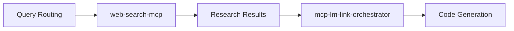
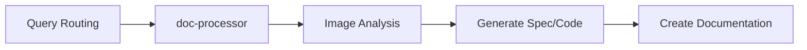
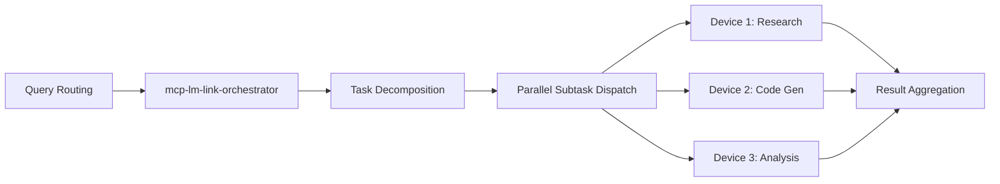
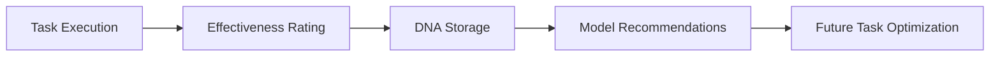

# Orchestration Templates

This document describes common orchestration patterns and templates for cross-MCP coordination across the mcp-local-helper, mcp-web-search, and doc-processor MCPs.

## Overview

The MCP orchestrator provides automatic task routing with intelligent selection of the appropriate MCP server based on query intent. This document covers common patterns for building effective cross-MCP workflows.

## Core Routing Rules

### Image & Visual Analysis → doc-processor
```javascript
Pattern: /image|visual|screenshot|diagram|ui|mockup|wireframe/i
MCP: doc-processor
Tool: read-doc (or analyze-image)
```

**Use Cases:**
- UI screenshot analysis and conversion to code
- Technical diagram interpretation
- Chart/graph data extraction

### Research Queries → web-search-mcp
```javascript
Pattern: /research|query|information|what is|compare|vs\.?|versus/i
MCP: web-search-mcp
Tool: get-web-search-summaries (or full-web-search)
```

**Use Cases:**
- Quick fact-finding across the web
- Compare multiple products or technologies
- Comprehensive research with full page content

### Code & Generation → mcp-lm-link-orchestrator
```javascript
Pattern: /code|function|class|create|write.*js|typescript/i
MCP: mcp-lm-link-orchestrator
Tool: execute-task (with automatic model selection)
```

**Use Cases:**
- Code generation with optimal model selection
- Bug fixes and debugging
- Feature architecture design

### Multi-Device Orchestration → mcp-lm-link-orchestrator
```javascript
Pattern: /multiple.*device|distributed|parallel.*execution/i
MCP: mcp-lm-link-orchestrator
Tool: orchestrate-task (DAG-based parallel execution)
```

**Use Cases:**
- Complex tasks decomposed into parallel subtasks
- Distributed research across lightweight models
- Multi-device load balancing

## Common Orchestration Patterns

### Pattern 1: Research → Code Generation Flow

**Description:** Research query results feed into code generation.



**Example Flow:**
1. Query: "Research modern React patterns and generate a todo app"
2. Route to web-search-mcp for research
3. Feed results to execute-task with codeGeneration intent
4. Model automatically selected based on task complexity

### Pattern 2: Image Analysis → Documentation Flow

**Description:** Analyze UI design, then create documentation.



**Example Flow:**
1. Query: "Analyze this Figma mockup and create documentation"
2. Route to doc-processor for image analysis
3. Extract UI components and specifications
4. Generate markdown or DOCX documentation

### Pattern 3: Multi-Device Parallel Execution

**Description:** Decompose complex task across multiple LM Link devices.



**Example Flow:**
1. Query: "Create a full-stack app with React frontend, Node backend, and PostgreSQL database"
2. Decompose into research (frontend), code generation (backend), and architecture design
3. Dispatch to optimal devices based on capabilities
4. Aggregate results into final deliverable

### Pattern 4: DNA-Driven Model Selection

**Description:** Use historical ratings to select best models for future tasks.



**Example Flow:**
1. Execute task with specific model
2. User or automatic rating collected
3. Rating stored in Model DNA
4. Future tasks of same type use highly-rated models

## Tool Chaining Examples

### Example 1: Full Research Pipeline

```json
{
  "steps": [
    {
      "mcp": "web-search-mcp",
      "tool": "full-web-search",
      "params": {
        "query": "Modern JavaScript state management options",
        "limit": 5,
        "includeContent": true
      }
    },
    {
      "mcp": "doc-processor",
      "tool": "create-markdown",
      "params": {
        "title": "JavaScript State Management Comparison",
        "paragraphs": [
          { "text": "# JavaScript State Management Options", "headingLevel": "heading1" },
          { "text": "Based on research, here are the top options...", "headingLevel": "heading2" }
        ]
      }
    }
  ]
}
```

### Example 2: Image to Code Pipeline

```json
{
  "steps": [
    {
      "mcp": "doc-processor",
      "tool": "ui-to-artifact",
      "params": {
        "image_source": "/path/to/design.png",
        "output_type": "code",
        "prompt": "Generate React component from this UI design"
      }
    },
    {
      "mcp": "mcp-lm-link-orchestrator",
      "tool": "execute-task",
      "params": {
        "query": "Refactor the generated code to use TypeScript and add unit tests",
        "modelType": "architect"
      }
    }
  ]
}
```

## Context Handover Between MCPs

### Strategy: Explicit Task Summary

When routing from one MCP to another, include a task summary:

```json
{
  "taskSummary": {
    "originalQuery": "Create a React app with auth",
    "completedWork": "Frontend structure created with routing and state management",
    "nextSteps": ["Implement authentication", "Add API integration"],
    "context": "React 18, TypeScript, Tailwind CSS"
  }
}
```

### Strategy: Result Metadata

Include metadata about the result for downstream processing:

```json
{
  "resultMetadata": {
    "sourceMcp": "web-search-mcp",
    "toolUsed": "full-web-search",
    "confidence": 0.87,
    "sourcesProcessed": 5,
    "timestamp": "2026-04-03T12:00:00Z"
  }
}
```

## Future Enhancements

### Auto-Discovery of Remote MCPs

Future versions could:
1. Scan network for available MCP servers
2. Register discovered MCPs automatically
3. Build dynamic routing table based on capabilities

### Adaptive Orchestration

Using historical performance data:
1. Learn optimal routing patterns for different task types
2. Adjust model selection based on task success rates
3. Optimize parallel execution strategies

### Enhanced Context Handover

Improved context management between MCPs:
1. Automatic summarization of previous results
2. Smart truncation for token limits
3. Semantic indexing for quick retrieval